# Smarter Pet Feeder — Flowcharts

All flowcharts are written in **Mermaid syntax**.
To use in draw.io: open draw.io → **Insert → Advanced → Mermaid** → paste the code block.

---

## Table of Contents

### Arduino
1. [System Initialization (setup)](#1-system-initialization-setup)
2. [Main Loop](#2-main-loop)
3. [Send Sensor Data (sendSensorData)](#3-send-sensor-data-sendsensordata)
4. [Humidity Check & Fan Control (checkHumidity)](#4-humidity-check--fan-control-checkhumidity)
5. [RFID Detection (checkRFID)](#5-rfid-detection-checkrfid)
6. [Serial Command Handler (handleSerial)](#6-serial-command-handler-handleserial)
7. [Timed Feed (triggerFeed)](#7-timed-feed-triggerfeed)
8. [Servo Open / Close](#8-servo-open--close)
9. [Precision Dispensing via Load Cell (checkDispensing)](#9-precision-dispensing-via-load-cell-checkdispensing)

### Edge Device (Raspberry Pi)
10. [System Startup (main.py)](#10-system-startup-mainpy)
11. [Serial Bridge Main Loop](#11-serial-bridge-main-loop)
12. [Serial Message Parser (parseMessage)](#12-serial-message-parser-parsemessage)
13. [DATA Message Handler](#13-data-message-handler)
14. [RFID Message Handler](#14-rfid-message-handler)
15. [Automation Rules — Humidity Fan (evaluateRules)](#15-automation-rules--humidity-fan-evaluaterules)
16. [Feeding Session State Machine](#16-feeding-session-state-machine)
17. [Ideal Portion Calculation (calcIdealPortion)](#17-ideal-portion-calculation-calcidealportion)
18. [Scheduled Feeding Checker](#18-scheduled-feeding-checker)
19. [Session Timeout Watcher](#19-session-timeout-watcher)
20. [Command Queue Flow (Dashboard → DB → Arduino)](#20-command-queue-flow-dashboard--db--arduino)
21. [Live Dashboard Data Refresh](#21-live-dashboard-data-refresh)
22. [Analytics API Data Flow](#22-analytics-api-data-flow)
23. [Pet Profile Management (CRUD)](#23-pet-profile-management-crud)
24. [Feed Schedule Management (CRUD)](#24-feed-schedule-management-crud)

---

## Arduino

---

### 1. System Initialization (setup)

Runs once on power-on. Sets up all hardware: serial, SPI bus, RFID reader, DHT11, load cell (HX711), servo, IR sensor pin, and relay pin.

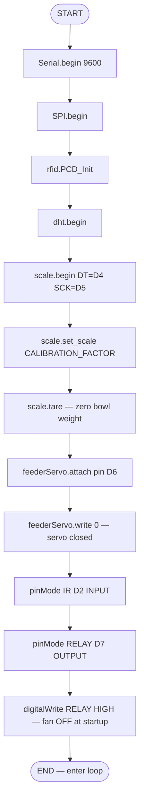

---

### 2. Main Loop

The Arduino loop runs continuously at ~500ms intervals. It processes serial commands, checks dispensing progress, reads and broadcasts sensor data, and scans for RFID tags.

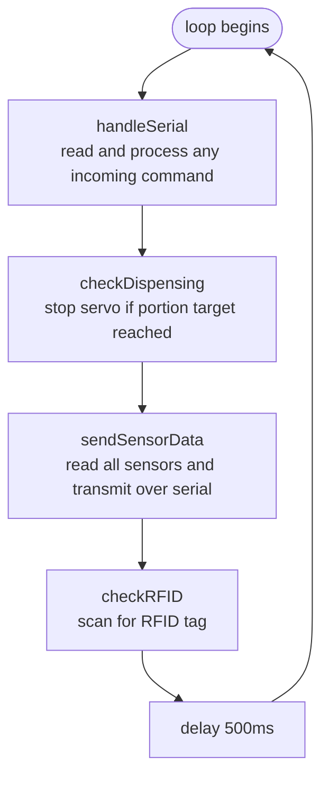

---

### 3. Send Sensor Data (sendSensorData)

Reads all sensors every loop iteration and sends a formatted DATA message over serial to the Raspberry Pi.

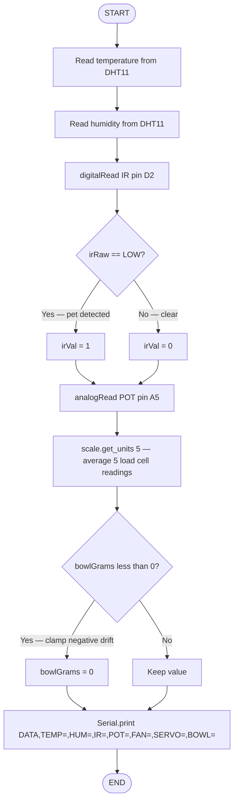

---

### 4. Humidity Check & Fan Control (checkHumidity)

Compares current humidity against the threshold and controls the relay/fan. Only acts if the state needs to change to avoid sending duplicate commands.

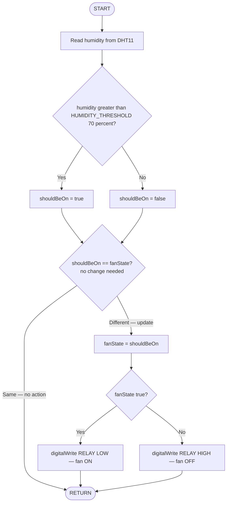

---

### 5. RFID Detection (checkRFID)

Checks if an RFID tag is present each loop cycle. If a tag is detected, reads its UID and transmits it to the Raspberry Pi.

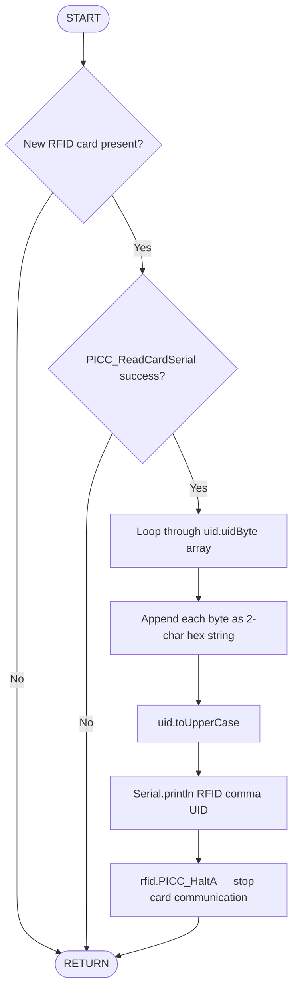

---

### 6. Serial Command Handler (handleSerial)

Reads any incoming command from the Raspberry Pi and routes it to the appropriate action. Supports timed feed, precision gram-based feed, fan control, servo control, tare, and status request.

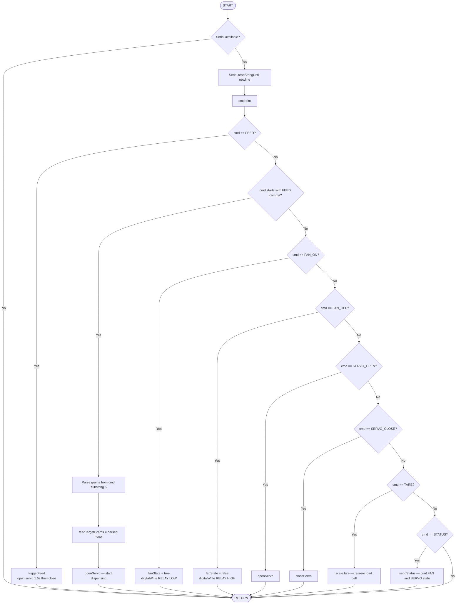

---

### 7. Timed Feed (triggerFeed)

Simple timed dispensing: opens servo for 1.5 seconds then closes. Used when a plain FEED command is received with no gram target.

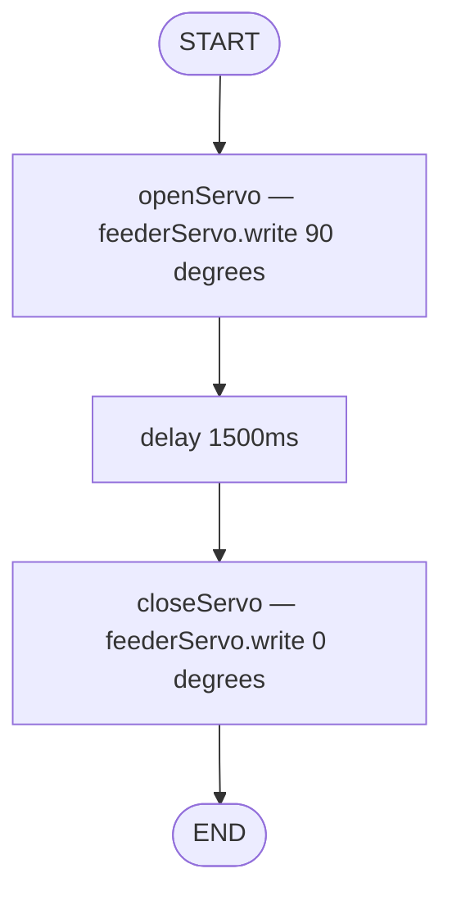

---

### 8. Servo Open / Close

Two helper functions. openServo snapshots the current bowl weight before dispensing begins so the gain can be measured. closeServo resets the servo and state flag.

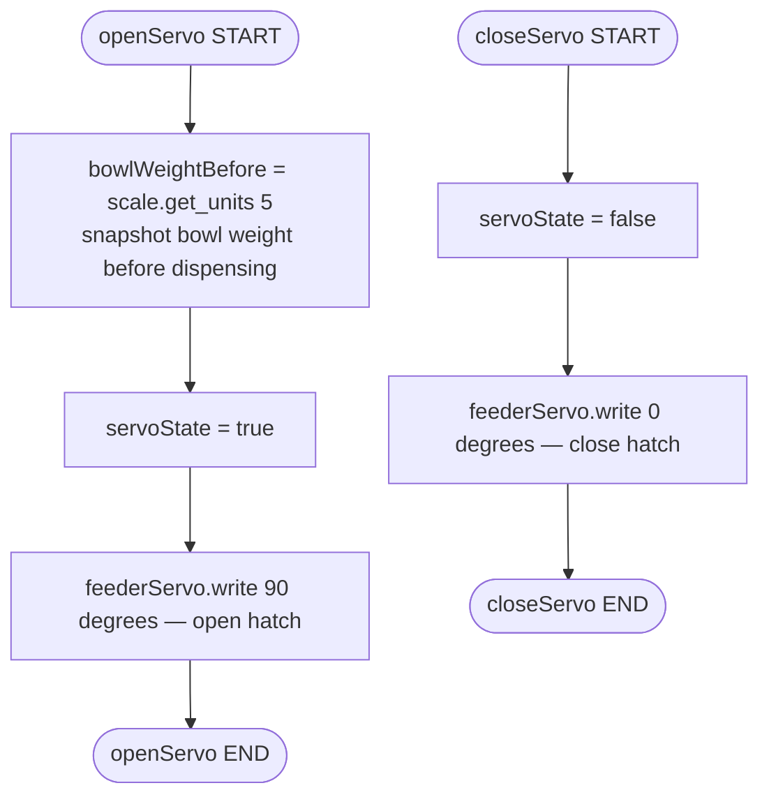

---

### 9. Precision Dispensing via Load Cell (checkDispensing)

Runs every loop cycle during a precision feed. Continuously reads the bowl weight and closes the servo once the target number of grams has been dispensed.

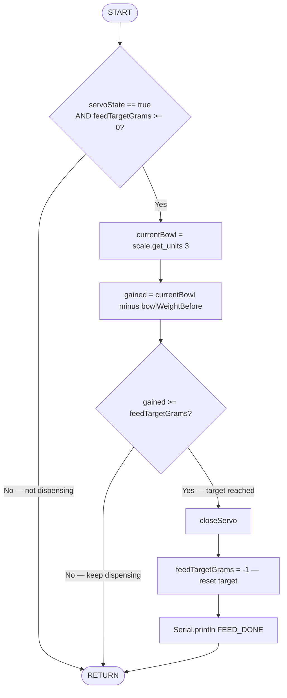

---

## Edge Device (Raspberry Pi)

---

### 10. System Startup (main.py)

Entry point for the entire edge system. Launches the serial bridge as a background thread, starts the scheduler threads, then runs the Flask server on the main thread.

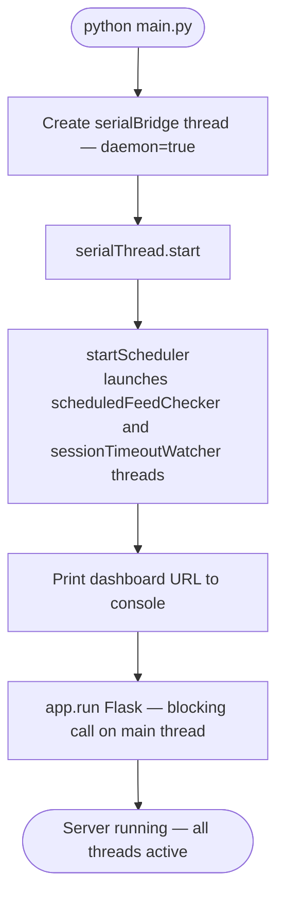

---

### 11. Serial Bridge Main Loop

Core background process. Continuously pulls queued commands from the database and sends them to Arduino, then reads and processes every incoming serial line from Arduino.

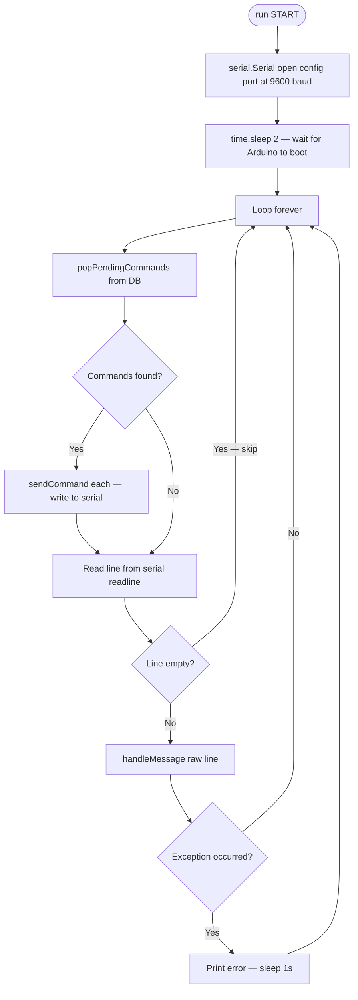

---

### 12. Serial Message Parser (parseMessage)

Parses raw ASCII strings from the Arduino into structured Python dicts. Handles four message types: DATA, RFID, STATUS, FEED_DONE.

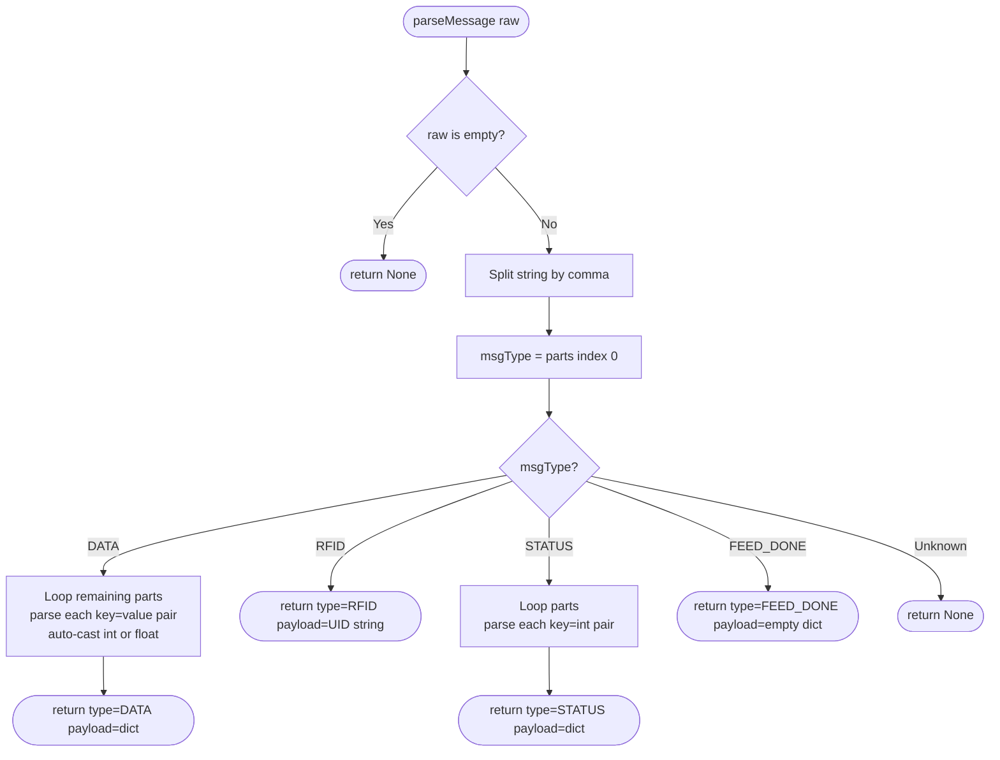

---

### 13. DATA Message Handler

Processes every DATA message from Arduino: stores the reading to the database, evaluates automation rules, updates the pot-based weight simulation, and notifies any active feeding session of IR state.

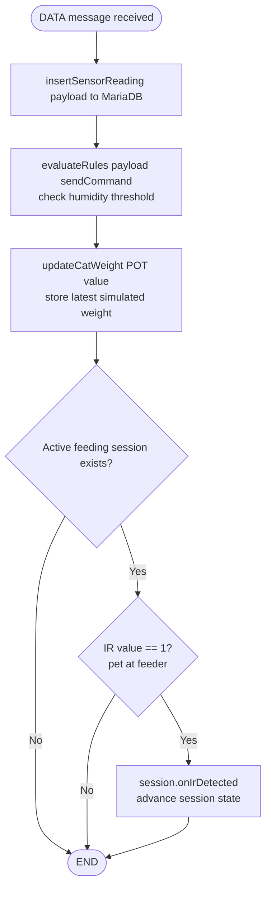

---

### 14. RFID Message Handler

Processes RFID scan events: logs the event to the database, looks up which pet owns that tag, and notifies the active feeding session to begin identification and dispensing.

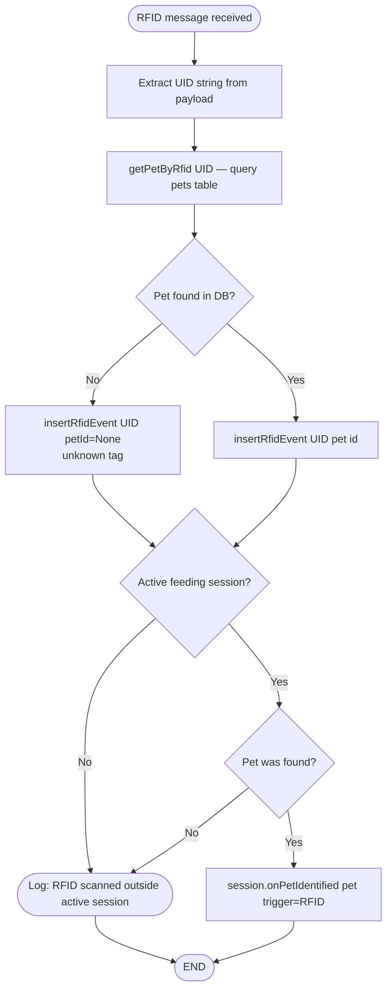

---

### 15. Automation Rules — Humidity Fan (evaluateRules)

Real-time rule that compares current humidity to the configurable threshold. Only sends a command if the fan state needs to change, preventing repeated serial writes.

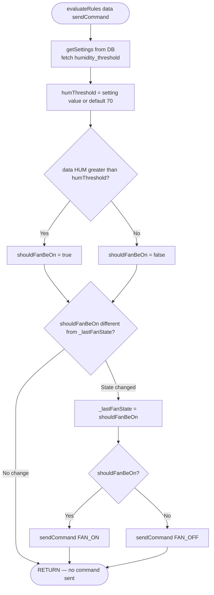

---

### 16. Feeding Session State Machine

Full lifecycle of a single feeding window. A session is started by the scheduler or manually. It transitions through states as IR detection and RFID scanning occur, supports multiple pets within one window, and ends on completion or timeout.

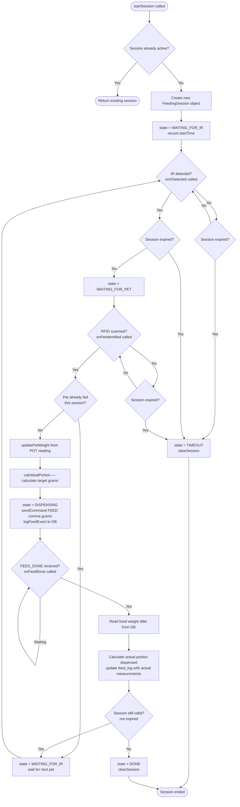

---

### 17. Ideal Portion Calculation (calcIdealPortion)

Three-tier priority system for calculating how many grams to dispense for a specific pet. Prioritises the pet's weight profile, then feeding history, then a simple ADC-based fallback.

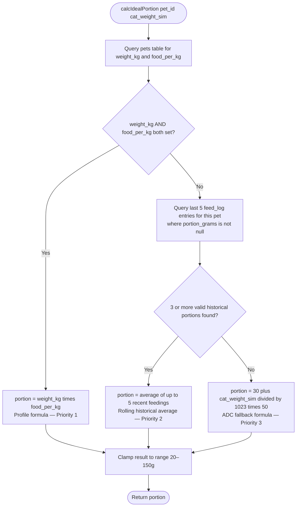

---

### 18. Scheduled Feeding Checker

Background thread that runs every 15 seconds. Checks if any enabled feed schedule matches the current time and has not already been triggered today. If so, starts a feeding session.

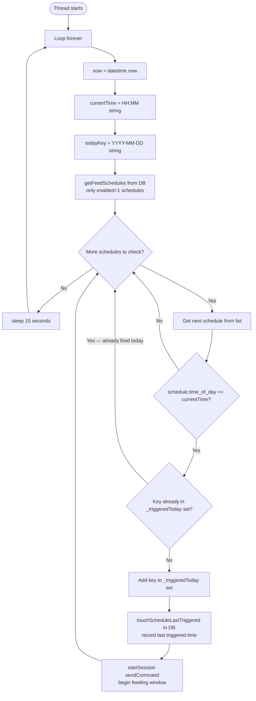

---

### 19. Session Timeout Watcher

Background thread that runs every 30 seconds. Checks if an active session has exceeded its time window and terminates it if so.

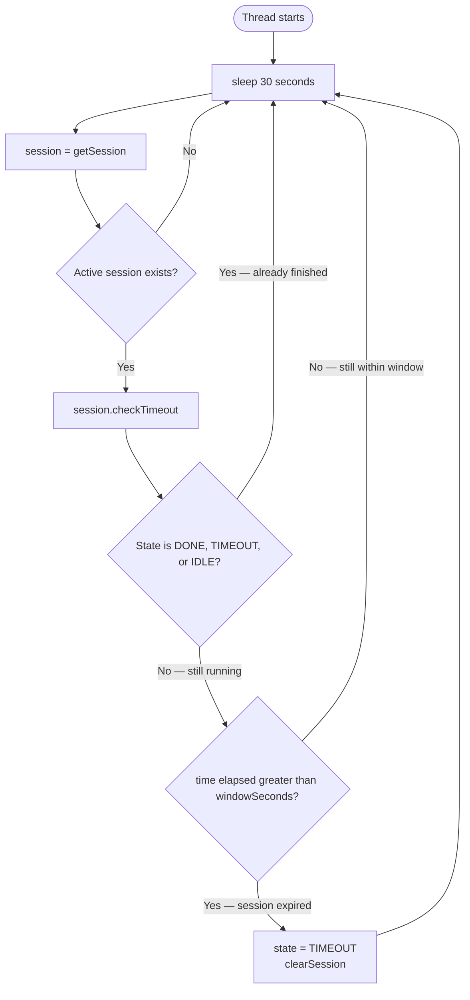

---

### 20. Command Queue Flow (Dashboard → DB → Arduino)

Shows how a manual command issued from the web dashboard travels through the system: validated and queued in the database by Flask, picked up by the serial bridge, and forwarded to the Arduino.

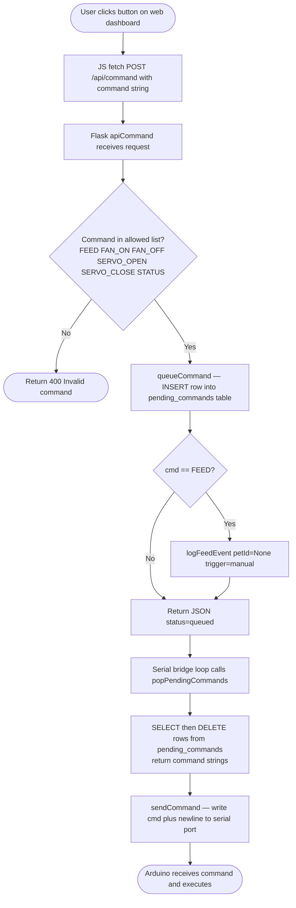

---

### 21. Live Dashboard Data Refresh

The index page polls the /api/latest endpoint every 5 seconds via JavaScript to keep all sensor readings current without a full page reload.

```mermaid
flowchart TD
    A([Browser loads index page]) --> B[index.html rendered by Flask]
    B --> C[JS setInterval every 5000ms]
    C --> D[fetch GET /api/latest]
    D --> E[Flask apiLatest called]
    E --> F[getLatestReading — SELECT from sensor_readings ORDER BY timestamp DESC LIMIT 1]
    F --> G[Build JSON response\ntemp hum IR bowl fan servo timestamp]
    G --> H[Add cat_weight_kg converted from POT ADC value]
    H --> I[Add rfid_today count for today]
    I --> J[Return JSON]
    J --> K[JS updates DOM elements on page]
    K --> C
```

---

### 22. Analytics API Data Flow

The /api/analytics endpoint aggregates sensor and feeding data for a configurable time window and returns statistics used to populate the analytics page charts and summary cards.

```mermaid
flowchart TD
    A([GET /api/analytics?hours=24]) --> B[getAnalyticsExtended hours]
    B --> C[Query sensor_readings\nAVG MIN MAX temperature and humidity\nSUM fan_on rows and COUNT total rows]
    C --> D[Calculate fan_on_pct percentage\nCalculate estimated fan_runtime_min]
    D --> E[Query feed_log COUNT for time window]
    E --> F[getTotalReadings — count of sensor rows in window]
    F --> G[getRfidStats — total RFID scans and avg per day]
    G --> H[getAvgPortion — average portion_grams from feed_log]
    H --> I[Merge all stats into single JSON object]
    I --> J([Return JSON — charts and stat cards update on page])
```

---

### 23. Pet Profile Management (CRUD)

Covers the full create/read/update/delete lifecycle for pet profiles on the Manage page. Pet profiles store the RFID tag UID, body weight, and food-per-kg ratio used to calculate portion targets.

```mermaid
flowchart TD
    A([Manage page loaded]) --> B[GET /api/pets]
    B --> C[getAllPets from DB\nattach calc_portion if weight and food_per_kg are set]
    C --> D[Render pet list on page]
    D --> E{User action?}
    E -->|Add new pet| F[POST /api/pets\nname and optional rfid_uid]
    E -->|Edit existing pet| G[PUT /api/pets/id\nname rfid_uid food_per_kg]
    E -->|Delete pet| H[DELETE /api/pets/id]
    F --> I{Name provided?}
    I -->|No| J([Return 400 Name is required])
    I -->|Yes| K[addPet — INSERT into pets table]
    G --> L[updatePet — UPDATE name rfid food_per_kg fields]
    H --> M[deletePet — DELETE from pets\nfeed_log references SET NULL]
    K --> N[Refresh pet list]
    L --> N
    M --> N
    N --> D
```

---

### 24. Feed Schedule Management (CRUD)

Covers creating and deleting scheduled feeding times from the Manage page. The scheduler thread reads enabled schedules every 15 seconds and triggers sessions automatically at match time.

```mermaid
flowchart TD
    A([Manage page loaded]) --> B[GET /api/schedules]
    B --> C[getAllSchedules from DB\nORDER BY time_of_day ASC]
    C --> D[Render schedule list on page]
    D --> E{User action?}
    E -->|Add new schedule| F[POST /api/schedules\nbody contains time_of_day HH:MM]
    E -->|Delete schedule| G[DELETE /api/schedules/id]
    F --> H{Valid HH:MM format?\nlen == 5}
    H -->|No| I([Return 400 Invalid time format])
    H -->|Yes| J[addSchedule — INSERT into feed_schedules enabled=1]
    G --> K[deleteSchedule — DELETE from feed_schedules]
    J --> L[Refresh schedule list]
    K --> L
    L --> D
```
